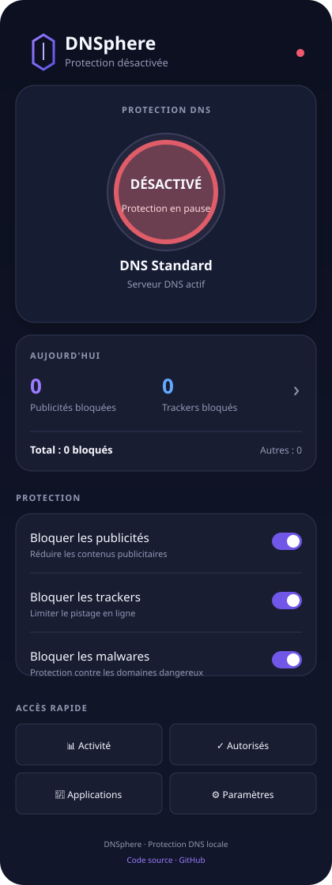

# DNSphere

DNSphere est une application Android de protection DNS locale. Elle utilise un VPN local pour analyser les requêtes DNS de l’appareil et bloquer les domaines publicitaires, les trackers et les domaines malveillants avant leur connexion.

## Fonctionnalités

- protection de toutes les applications, pas uniquement du navigateur ;
- fonctionnement local, sans compte et sans serveur DNSphere ;
- prise en charge des transports DNS standard, DoH, DoT, DoQ et DoH3 ;
- fournisseurs DNS configurables, dont Cloudflare, Quad9, Google, AdGuard, Mullvad et DNS4EU ;
- blocage des publicités, trackers, malwares et catégories configurables ;
- profils et horaires automatiques, y compris les créneaux de nuit ;
- contrôle parental et SafeSearch ;
- règles personnalisées, whitelist et blocage forcé ;
- filtrage DNS par application ;
- statistiques locales et journaux de blocage ;
- pause temporaire complète de la protection depuis la notification ;
- sélecteur rapide de fournisseur DNS ;
- validation HTTPS des listes externes ;
- aucune collecte de données par DNSphere.

## Confidentialité

DNSphere ne nécessite pas de root et ne transfère pas les requêtes à un serveur appartenant au projet. Les requêtes sont traitées localement par le VPN Android, puis envoyées au fournisseur DNS choisi par l’utilisateur.

## Installation

Le projet est compilable avec Android Studio et Gradle. Ouvrez le dossier dans Android Studio, synchronisez Gradle, puis lancez `assembleDebug` ou `assembleRelease`.

## Configuration

Après installation :

1. activez la protection depuis l’écran principal ;
2. choisissez le fournisseur DNS dans les paramètres ;
3. activez les catégories de blocage souhaitées ;
4. configurez les profils, le contrôle parental et les listes si nécessaire.

## Licence

DNSphere est distribué sous licence GNU GPL v3. Consultez le fichier [`licence`](licence) pour les conditions applicables.

## Auteur

Projet créé par [souffly007](https://github.com/souffly007).

Résultat : moins de pubs, moins de tracking, navigation plus rapide !

━━━ AVANTAGES ━━━

✓ Protège TOUTES les applications (pas juste le navigateur)
✓ Aucun serveur externe - 100% local
✓ Aucune donnée collectée
✓ Pas de root nécessaire
✓ Gratuit, sans pub, sans abonnement
✓ Léger (~5 MB)
✓ Batterie préservée

## License
DNSphere is licensed under the GNU General Public License v3.0
See LICENSE for details.

"Commercial use, including distribution as part of a paid product or service, is not permitted without prior written consent of the author."
